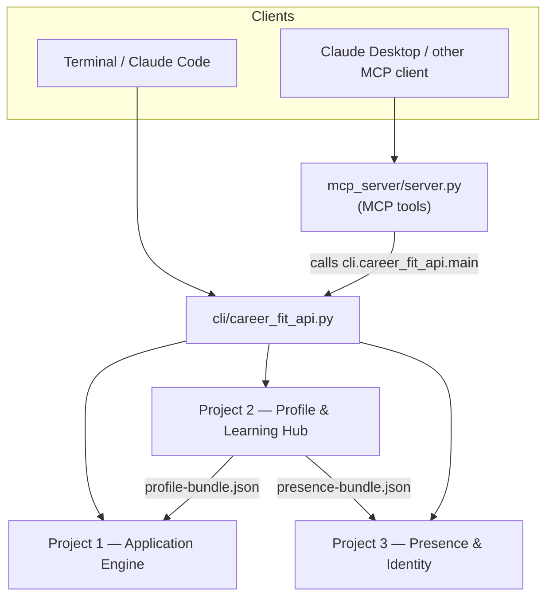
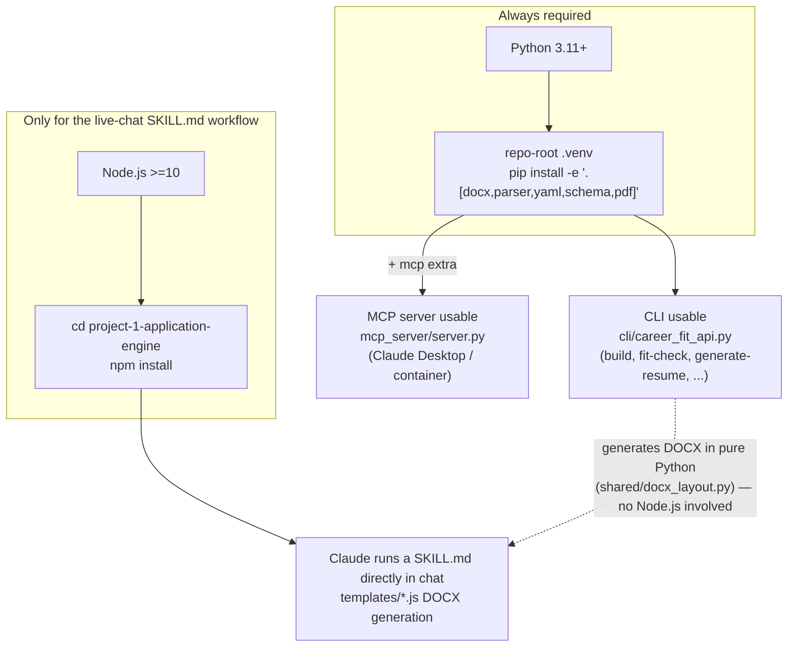

# career-fit-assistant

A deterministic, fit-gated document generation engine exposed to AI assistants over MCP — refuses to draft a resume or cover letter when a job description's skill match falls below a Good rating, rather than producing a generic one. Built as three coordinated projects powering a real job-search workflow: Project 2 is the single source of truth for career facts, Projects 1 and 3 consume generated bundles from it.

> **This is a sanitized public snapshot.** It's exported from a private working repo with the same architecture, replacing all personal data with a fictional example persona (`project-2-profile-learning-hub/Resume_Snapshot.md` — "Sarah Ashford," a made-up person) and starting a fresh git history with no link back to that private repo. Clone it, install, and run `python3 -m cli.career_fit_api build` — the whole pipeline — fit rating, resume/cover-letter generation, learning-plan PDFs — works end to end against the example data:
>
> ```bash
> git clone <repo-url> career-fit-assistant && cd career-fit-assistant
> python3 -m venv .venv && source .venv/bin/activate   # Windows: .venv\Scripts\activate
> pip install -e ".[docx,yaml,schema,pdf]"
> python3 -m cli.career_fit_api build
> ```
>
> For the MCP server (Claude Desktop integration), see the step-by-step setup in [mcp_server/README.md](mcp_server/README.md).

## Architecture



Two ways in: a terminal invokes `cli/career_fit_api.py` directly; an MCP client
like Claude Desktop calls `mcp_server/server.py`, which is a thin adapter
that builds the same argv the CLI would and calls `cli.career_fit_api.main()` —
see [mcp_server/README.md](mcp_server/README.md). Either way, the CLI is the
single dispatcher into the three projects below.

**Bundle model (v3 sequential):** Project 2's `profile-hub-bundle-generator` skill compiles the four canonical source files into two bundles. Each downstream project reads its bundle directly — no network fetch, no cross-project file imports. Bundle regeneration is gated by 6 consistency checks (cert sync, AI-200 wording sync, gap closure, differentiator coverage, course count regression, badge URL format). The authoritative bundles are now produced as JSON: `outputs/profile-bundle.json` (PII-allowed) and `outputs/presence-bundle.json` (GitHub-safe).

**Distribution:** this public repo is a sanitized snapshot exported from a private working repo (`andreak3779/claude-projects`). `app-engine-bundle.md` contains PII and is gitignored, same as in the private repo. `presence-bundle.md` is committed and serves as the public-safe source of truth. `Resume_Snapshot.md` here is the fictional example persona, not real career data.

## Projects

- **[project-1-application-engine/](project-1-application-engine/)** — generates tailored job-application artifacts: gap analyses, resumes, cover letters, interview prep, salary research. Reads `outputs/profile-bundle.json`. 13 skills, 4 DOCX templates, 5 reference docs.
- **[project-2-profile-learning-hub/](project-2-profile-learning-hub/)** — source of truth for career facts, Pluralsight/MS-Learn learning history, and portfolio projects. 8 skills, 2 Python utility scripts (Pluralsight HTML parser, learning-plan PDF template), 8 markdown data files.
- **[project-3-presence-identity/](project-3-presence-identity/)** — LinkedIn, GitHub, Jobgether, Indeed/ZipRecruiter, and Pluralsight profile updates. Reads `presence-bundle.md` directly (GitHub's generator is the exception, reading `outputs/presence-bundle.json`). 5 skills.

Each project has its own `README.md` and `CLAUDE.md`; the CLAUDE.md files document project-local conventions, the sync protocol, and PII rules.

## Bundle generation

The single skill that owns all bundle regeneration lives in Project 2: **[skills/profile-hub-bundle-generator_SKILL.md](project-2-profile-learning-hub/skills/profile-hub-bundle-generator_SKILL.md)**.

It runs 6 sequential consistency checks before writing anything, and produces two output files in their canonical project locations:

| Output | Path | PII | Git |
| --- | --- | --- | --- |
| `app-engine-bundle.md` | `project-1-application-engine/` | yes (email, phone) | ignored |
| `presence-bundle.md` | `project-3-presence-identity/` | no | committed |
| `outputs/profile-bundle.json` | repo root | yes | ignored |
| `outputs/presence-bundle.json` | repo root | no | ignored |

**Run it whenever** any of these events happen:

- Certification status changes (AZ-900, AI-200, …)
- Gap status changes in `profile-facts.md`
- Resume section edited
- Portfolio project added or updated in `github-repos.md`
- A Pluralsight course closes a known gap
- (Course count update only, no gap change → no regen needed)

See the skill file for the full sync protocol and consistency-check rules.

## Fresh OS install

Start here after a clean OS install/reimage, before touching any individual
project. There are two independent toolchains — Python (repo root + Project 2)
and Node.js (Project 1) — but **Node.js is only needed for one specific
workflow**, not for the CLI or MCP server. See the diagram below, then follow
the numbered steps for your use case.



1. **Python 3.11+** — check with `python3 --version`. On Debian/Ubuntu the
   venv module ships separately: `sudo apt install python3-venv` if step 2
   fails.
2. **Repo-root Python setup** — see the quick-start block at the top of this
   file. Installs the monorepo CLI and its dependencies (`docx`, `yaml`,
   `schema`, `pdf` extras) into `.venv/`.
3. **MCP server (optional, only if you use Claude Desktop)** — see
   [mcp_server/README.md](mcp_server/README.md#setup). Adds the `mcp` extra
   on top of step 2's venv.
4. **Project 2 Python deps** — see
   [project-2-profile-learning-hub/README.md](project-2-profile-learning-hub/README.md).
   Only needed if you'll run `parse_pluralsight_html.py` or `pdf-template.py`
   directly; both packages' dependencies already overlap with the root
   `parser`/`pdf`/`docx` extras.
5. **Node.js (Project 1 only, and only for the live-chat SKILL.md
   workflow)** — skip this step entirely if you'll only use the CLI or MCP
   server: `generate-resume`/`generate-cover-letter`/etc. generate DOCX files
   in pure Python (`shared/docx_layout.py` + `python-docx`, already installed
   by step 2's `docx` extra) and never shell out to Node.js. Node.js is only
   used when Claude runs a skill's `SKILL.md` instructions directly in a chat
   session (not through the CLI/MCP), which shells out to
   `templates/*.js` for DOCX generation instead. If you need that workflow:
   check with `node --version` (any Node ≥10), install via your distro's
   package manager or [nodesource](https://github.com/nodesource/distributions)
   if missing, then `cd project-1-application-engine && npm install` — see
   [project-1-application-engine/README.md](project-1-application-engine/README.md).
6. **Pre-commit hook (optional but recommended)** —
   `bash scripts/install-hooks.sh` from the repo root. See
   [Local pre-commit hook](#local-pre-commit-hook-zero-cost-substitute-for-ci-on-push)
   below.

Project 3 needs no local install — it only reads a committed markdown bundle.

## CLI

A monorepo CLI lives in [cli/career_fit_api.py](cli/career_fit_api.py). From the repo root:

```bash
python3 -m cli.career_fit_api build          # regenerate JSON bundles
python3 -m cli.career_fit_api validate       # run 6 canonical consistency checks
python3 -m cli.career_fit_api fit-check <jd.md>        # inline fit table for a JD
python3 -m cli.career_fit_api gap-analysis <jd.md>     # markdown gap-analysis report
python3 -m cli.career_fit_api generate-linkedin        # LinkedIn profile copy
python3 -m cli.career_fit_api generate-github          # GitHub profile README copy
python3 -m cli.career_fit_api generate-jobgether       # Jobgether profile copy
python3 -m cli.career_fit_api generate-job-board       # Indeed & ZipRecruiter profile copy
python3 -m cli.career_fit_api generate-pluralsight     # Pluralsight profile copy
```

Use `python3 -m cli.career_fit_api <command> --help` for each command's options.

### MCP server

[mcp_server/](mcp_server/) exposes the same CLI commands as MCP tools for
Claude Desktop or any other MCP-capable client — see
[mcp_server/README.md](mcp_server/README.md) for install and setup.

### Fit engine

`shared/fit_engine.py` is the deterministic rating engine used by `fit-check` and `gap-analysis`. It classifies each JD skill as production (`match`), portfolio (`portfolio`), coursework (`course`), or no evidence (`gap`) and derives an overall `Strong / Good / Stretch / Pass` rating. It handles multi-token phrases, years-of-experience prefixes, and a small alias map for common co-occurring terms (e.g., C# ↔ .NET, REST API ↔ ASP.NET Core Web API).

Ratings are driven by a weighted score where production evidence is worth more than portfolio or coursework: `match=1.0`, `portfolio=0.7`, `course=0.4`, `gap=0.0`. A required-skill score of 85%+ with 50%+ nice-to-have coverage yields **Strong**; 60%+ without gaps yields **Good**; any gaps but 30%+ weighted score yields **Stretch**; otherwise **Pass**.

The engine handles:

- **Alias expansion** — common co-occurring terms (e.g., C# ↔ .NET, REST API ↔ ASP.NET Core Web API) via [`shared/aliases.json`](shared/aliases.json).
- **Compound splitting** — slashes, semicolons, "and"/"or" in JD phrases are split so partial matches register.
- **Years-prefix normalization** — "5+ years of C#" becomes "c#" before matching.
- **Genuine-gap fallback** — skills explicitly listed as known genuine gaps can still earn `portfolio` or `course` status if the gap record says so.

Alias data lives in [`shared/aliases.json`](shared/aliases.json). The registry is loaded at import time, and `validate` confirms it is well-formed. To add a new synonym pair, edit that JSON file and re-run `validate`; no Python code changes are required.

### Tests

Run the full suite with:

```bash
python3 -m pytest tests/ -q
```

The suite covers bundle loading, the fit engine, JD parsing, and CLI smoke tests for `fit-check`, `gap-analysis`, and all five profile-update generators (`generate-linkedin`, `generate-github`, `generate-jobgether`, `generate-job-board`, `generate-pluralsight`).

## CI

`.github/workflows/ci.yml` runs:

1. DOCX template syntax check (project-1)
2. PII guard on `app-engine-bundle.md`
3. Pluralsight JSON validation
4. JSON bundle build (Project 2)
5. 6 canonical bundle-validation checks plus alias-registry shape check
6. `pytest` suite
7. CLI end-to-end smoke tests (`build`, `validate`, `fit-check`, `gap-analysis`, `generate-linkedin`, `generate-github`, `generate-jobgether`, `generate-job-board`, `generate-pluralsight`)

This workflow is `workflow_dispatch`-only (no `push`/`pull_request` trigger) — deliberately, to avoid billed GitHub Actions runner time on every commit. That means none of the above runs automatically. The local git pre-commit hook below is the actual enforcement for the two checks that matter most day to day (bundle consistency, skill hardcoding) — run the full CI workflow by hand before anything you especially want double-checked.

### Local pre-commit hook (zero-cost substitute for CI-on-push)

One-time setup:

```bash
bash scripts/install-hooks.sh
```

This installs `scripts/hooks/pre-commit` into `.git/hooks/pre-commit` (git hooks aren't tracked by git themselves, so this copy step is required once, and again any time `scripts/hooks/pre-commit` changes). It then runs automatically on every `git commit` and blocks the commit if `ruff check`, `check_skill_hardcoding.py`, `check_bundle_freshness.py`, or `validate.py` (when a bundle exists) fail. It intentionally skips the full `pytest` suite and `mypy` — those are quick enough to run manually before pushing but slower than what belongs on every commit. Bypass with `git commit --no-verify` if you're deliberately committing through a known failure.

## Data flow scripts

Project 2 has two personal-utility Python scripts:

- **`parse_pluralsight_html.py`** — parses a Pluralsight HTML export, merges into `data/pluralsight_learning_history.json` (authoritative), and writes a regenerated output JSON. Run after every Pluralsight sync. No automated tests — manually spot-checked against `pluralsight-courses.md` after changes. This snapshot doesn't include `data/pluralsight_learning_history.json` itself (personal learning-activity data, not needed by the build pipeline or test suite) — the script and its fixture-based tests are still here for reference.
- **`pdf-template.py`** — Data-driven ReportLab engine for role-specific learning-plan PDFs. Reads a role config from `roles/<slug>.json` (see `roles/_example.json` for the schema) and writes the PDF to the path declared in `output`. Run with `python pdf-template.py roles/<slug>.json`.

## Notes

- This is a **public** snapshot exported from a private working repo — real personal data was replaced before publishing: `Resume_Snapshot.md` here is a fictional example persona (see the note at the top of this file), and `app-engine-bundle.md` (real PII when generated) stays gitignored exactly as in the private repo.
- `outputs/` directories in each project are working dirs (regenerated artifacts) and are gitignored at the repo root.
- venv: `.venv/` is gitignored at both the repo root and project-2 level (belt-and-suspenders).

## Changelog

### v0.2.0

- **Strict alias validation in `shared/fit_engine.py`** — `_load_aliases()` now raises `ValueError` on malformed alias entries (non-list, non-string items, missing keys) instead of iterating single-character strings silently and silently scoring everything as a match. Malformed `aliases.json` will now fail loudly at fit-check time.
- **Expanded JD parser section-end regex (`shared/jd_parser.py`)** — adds "What we offer", "Benefits", "Perks", "Compensation", "Why join/work", "About us/the company", "Our culture", and "Company overview" as section-reset headings so the requirements parser stops picking up boilerplate as required skills.
- **`pre-commit` already includes `check_bundle_freshness.py` + `outputs/profile-bundle.json` gate** (this was a no-op migration — public was already ahead of private on this front).
- **New `tests/test_cli_common.py`** (5 tests) + **`_cli_common.py` extended** with `load_bundle_or_none()`, `print_wrote()`, `run_and_report()` helpers from the private repo.
- **New `shared/copy_fragments.py` and `shared/cert_status.py`** — extraction of cert-status and copy-fragment computation from `render_md_bundles.py` into shared helpers, so future generators (LinkedIn / Jobgether / Job Board / Pluralsight profile drafts) can call them directly from a loaded bundle without re-parsing the rendered markdown. `render_md_bundles.py` is wired to the new modules; `tests/test_render_md_bundles.py` updated to test the public-API surface.

### v0.1.0

Initial public release.

