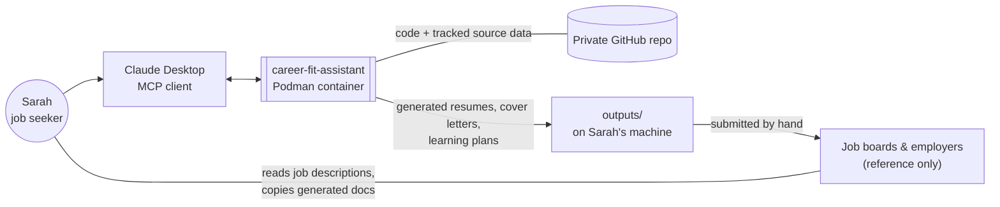
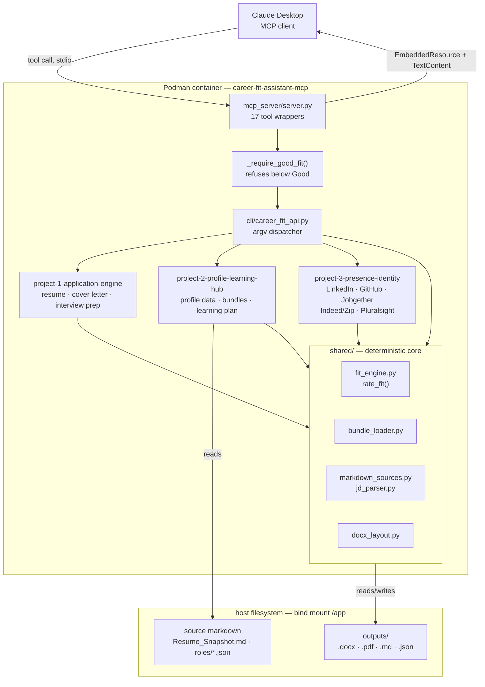
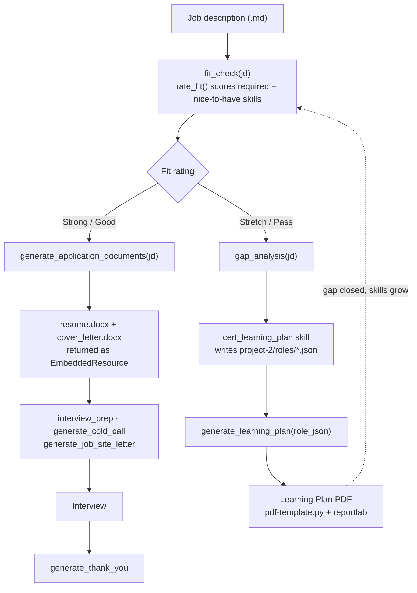

# career-fit-assistant — architecture & workflow

A deterministic job-search automation toolkit: one CLI, one MCP server,
three domain projects, and a shared fit-rating engine — no LLM calls at
runtime, every rating and artifact traceable back to source markdown.

An interactive, styled version of these diagrams (with a legend keyed to
real file paths and the fit-rating thresholds) is also published at
<https://claude.ai/code/artifact/ff29c694-3c2a-4232-bda2-e7b1a6a644c3>.
For the reasoning behind the decisions this page depicts, see
[docs/adr/](adr/) and [docs/quality-attributes.md](quality-attributes.md).
This page covers runtime architecture only — for what to install on a new
machine (Python vs. Node.js, which is needed for which workflow), see the
setup-dependency diagram in [README.md → Fresh OS
install](../README.md#fresh-os-install).

## System context

Zoomed out one level further than the diagram below: what surrounds the
system, not what's inside it. `career-fit-assistant` itself has no integrations —
job descriptions and profile updates move in and out by hand, deliberately
(see [ADR 0004](adr/0004-stdio-only-transport.md) on why nothing here is
network-facing).

## Container & component view

Claude Desktop spawns the container as a local child process and speaks
MCP over its stdin/stdout. Inside, `mcp_server/server.py` is a thin
adapter — every tool builds the same argv the CLI itself uses, so the MCP
layer and a terminal user hit identical code paths. `shared/` holds the
only logic that isn't a straight pass-through: fit rating, bundle loading,
and markdown parsing, all deterministic.

| Layer | Path |
| --- | --- |
| Client | Claude Desktop → `podman run -i --rm` |
| Server | `mcp_server/server.py` |
| Dispatcher | `cli/career_fit_api.py` |
| Domain core | `shared/fit_engine.py`, `bundle_loader.py`, `markdown_sources.py` |
| Document generation | `project-1-application-engine/skills/*/scripts` |
| Profile source of truth | `project-2-profile-learning-hub/*.md`, `roles/*.json` |
| Public presence | `project-3-presence-identity/presence-bundle.md` |
| Artifacts | `outputs/` — bind-mounted, gitignored |

## Workflow — from job description to application

Every generation path runs through the same fork: a job description is
rated before anything is drafted, and resume/cover-letter generation
refuses outright below a **Good** rating rather than producing a weak
application.

| Rating | Rule |
| --- | --- |
| **Strong** | Required + nice-to-have skills both well covered by proven, production evidence. |
| **Good** | Required skills covered; some nice-to-have gaps. Minimum bar to draft. |
| **Stretch** | Real gaps in required skills — routed to gap analysis, not drafting. |
| **Pass** | Fundamental mismatch. Generation is refused with a `ToolError`. |

1. **Rate.** `fit_check` parses the JD's required/nice-to-have skills and
   scores them against the profile bundle — deterministic, no model call.
2. **Gate.** Below `Good`, `generate_resume`/`generate_cover_letter`/
   `generate_application_documents` refuse outright —
   `_require_good_fit()` in `mcp_server/server.py`.
3. **Draft or close the gap.** Strong/Good routes straight to document
   generation; Stretch/Pass routes to `gap_analysis`, which can feed a
   learning-plan PDF instead.
4. **Return.** Every tool returns the artifact's real content over MCP, not
   just a written-to path. How depends on the artifact: the five
   profile-update tools (`generate_linkedin`, `generate_github`,
   `generate_jobgether`, `generate_job_board`, `generate_pluralsight`) and
   every `.docx`/`.pdf` tool come back as an `EmbeddedResource` — text for
   markdown, base64 for binary — so MCP clients like Claude Desktop render
   them as an attachment. Other markdown/JSON output (`gap_analysis`,
   provenance sidecars) stays inline `TextContent`, since that content is
   meant to be read in the conversation itself.
