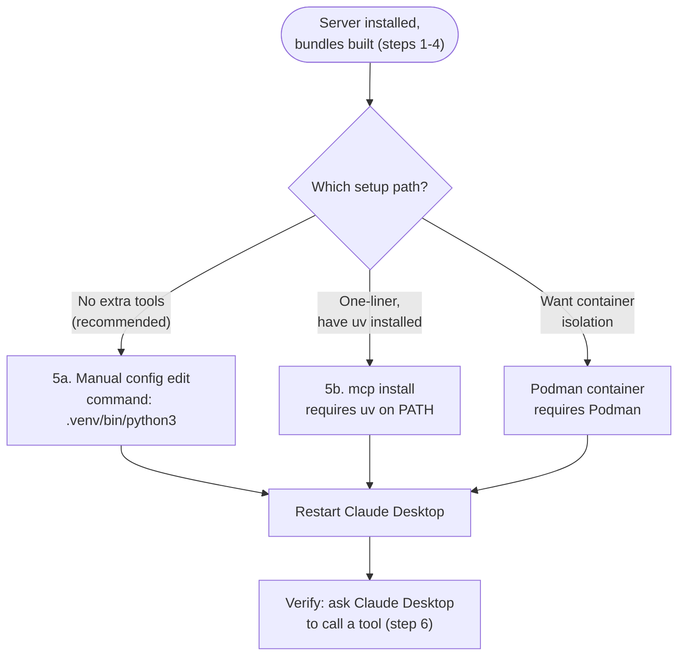

# career-fit-assistant MCP server

Exposes the `career-fit-assistant` CLI (`cli/career_fit_api.py`) as MCP tools so an MCP
client — Claude Desktop, or any other MCP-capable app — can build bundles,
run fit checks, and generate application documents without a terminal.

Every tool is a thin wrapper: it builds the same argv list the CLI itself
uses and calls `cli.career_fit_api.main(argv)`, capturing stdout/stderr. No
generation logic lives here — see `cli/career_fit_api.py` and the
`project-*/scripts/*.py` modules for that — with one deliberate exception:
`generate_resume`, `generate_cover_letter`, and `generate_application_documents`
re-run the same fit-rating check those scripts already do internally, as a
gate before dispatching (see "Fit gate" below).

## Tools

| Tool | CLI equivalent |
| --- | --- |
| `build_bundles` | `build` |
| `validate_bundles` | `validate` |
| `fit_check(jd)` | `fit-check <jd>` |
| `gap_analysis(jd, out=None)` | `gap-analysis <jd> [--out]` |
| `generate_linkedin(out=None)` | `generate-linkedin [--out]` |
| `generate_github(out=None)` | `generate-github [--out]` |
| `generate_jobgether(out=None)` | `generate-jobgether [--out]` |
| `generate_job_board(out=None)` | `generate-job-board [--out]` |
| `generate_pluralsight(out=None)` | `generate-pluralsight [--out]` |
| `generate_resume(jd, company=None, out=None)` | `generate-resume <jd> [--company] [--out]` |
| `generate_cover_letter(jd, company=None, out=None)` | `generate-cover-letter <jd> [--company] [--out]` |
| `generate_application_documents(jd, company=None)` | resume + cover-letter in one call |
| `generate_cold_call(jd, company=None, out=None)` | `generate-cold-call <jd> [--company] [--out]` |
| `generate_job_site_letter(jd, company=None, out=None)` | `generate-job-site <jd> [--company] [--out]` |
| `generate_thank_you(jd, company=None, out=None)` | `generate-thank-you <jd> [--company] [--out]` |
| `interview_prep(jd, out=None)` | `interview-prep <jd> [--out]` |
| `generate_learning_plan(role_json)` | `generate-learning-plan <role_json>` |

`jd`, `out`, and `role_json` paths may be absolute or relative to the repo
root (path resolution is anchored to this file's location, not the
process's working directory, same as the CLI). Prefer absolute paths from
MCP clients since they don't have a reliable notion of "current directory."
For `generate_learning_plan`, this applies to the role config's own
`"output"` key too — it's resolved relative to this server's working
directory, so prefer an absolute path there as well.

A failed command (non-zero exit code) raises an MCP tool error containing
the captured stdout/stderr, so the client sees it as a failure rather than a
silent success.

## Returned content

Every document-producing tool (everything above except `build_bundles`,
`validate_bundles`, and `fit_check`) returns the artifact's actual content,
not just the local path it was written to — that's what makes a generated
resume, cover letter, gap analysis, or learning-plan PDF retrievable through
a client with no filesystem access to this machine's `outputs/` folders. The
file is still written to its normal `outputs/` location as before — this is
additive, not a replacement.

How that content comes back depends on the tool:

- **Profile-update tools** (`generate_linkedin`, `generate_github`,
  `generate_jobgether`, `generate_job_board`, `generate_pluralsight`) — their
  markdown draft *is* the deliverable, so every artifact they write (the
  draft plus its provenance sidecars) comes back as a text `EmbeddedResource`
  (`text/markdown` or `application/json`). MCP clients like Claude Desktop
  render an `EmbeddedResource` as an attachment, so the draft shows up as a
  document rather than getting dumped into the chat transcript as a wall of
  text.
- **Everything else that produces markdown/text/JSON** (gap analyses,
  provenance `.meta.json` sidecars from other tools) comes back as inline
  text — that content is meant to be read and discussed directly in the
  conversation.
- **DOCX and PDF artifacts** (resumes, cover letters, thank-you notes,
  learning plans, etc.) come back as a base64-encoded `EmbeddedResource`
  with the correct MIME type, same as before.

## Fit gate

`generate_resume`, `generate_cover_letter`, and `generate_application_documents`
refuse to generate (raising a tool error with the rating and rationale) when
the JD's computed fit rating is below Good. This enforces, in code, the same
rule the `create-a-cover-letter-and-tailored-resume-for-job-description`
skill already states as prompt guidance — an MCP client calling these tools
directly bypasses that skill (and its judgment) entirely, so the rule is
checked here too. Call `fit_check` first to see the rating without
generating documents. No other tool is gated this way.

## Setup

### 1. Prerequisites

- Python 3.11+ and `git`.
- **`uv`** ([astral.sh/uv](https://astral.sh/uv)) — only needed if you use the
  `mcp install` shortcut in step 5b below. The manual config path in step 5a
  doesn't need it.
- **Node.js/npm** (specifically `npx` on PATH) — only needed for the optional
  MCP Inspector in step 6. Not needed to actually run the server.

Skipping `uv` or Node.js is fine as long as you skip the steps that need
them — nothing else in this setup requires either.

### 2. Clone and create a virtual environment

```bash
git clone <repo-url> career-fit-assistant && cd career-fit-assistant
python3 -m venv .venv
source .venv/bin/activate        # Windows: .venv\Scripts\activate
```

### 3. Install dependencies

```bash
pip install -e ".[mcp,docx,yaml,schema,pdf]"
```

This covers every MCP tool. (The `parser` extra — `beautifulsoup4`/`lxml` —
is not needed here; it's only used by Project 2's standalone
`parse_pluralsight_html.py` utility script, not by anything the MCP server
calls.)

### 4. Build the bundles once

```bash
python3 -m cli.career_fit_api build
```

Every tool that reads career data (`fit_check`, `gap_analysis`,
`generate_resume`, ...) reads `outputs/profile-bundle.json` /
`outputs/presence-bundle.json`. Those files are gitignored and don't exist
until this runs at least once — skip it and the first real tool call fails
with a missing-file error. (The `build_bundles` MCP tool can regenerate them
later from within Claude Desktop; this first run has to happen from the CLI
before the server is wired up.)

### 5. Wire up Claude Desktop

The three paths below have different prerequisites — pick based on what's
already on your machine:



**5a. Manual config edit (recommended — no extra tools required):**

- macOS: `~/Library/Application Support/Claude/claude_desktop_config.json`
- Linux: `~/.config/Claude/claude_desktop_config.json`
- Windows: `%APPDATA%\Claude\claude_desktop_config.json`

```json
{
  "mcpServers": {
    "career-fit-assistant": {
      "command": "/path/to/career-fit-assistant/.venv/bin/python3",
      "args": ["-m", "mcp_server.server"],
      "cwd": "/path/to/career-fit-assistant/"
    }
  }
}
```

Use the absolute path to the venv's `python3` you created in step 2 (Windows:
`...\.venv\Scripts\python.exe`).

**5b. Alternative: `mcp install` one-liner (requires `uv` on PATH).**

`mcp install` doesn't run the server itself — it writes a
`claude_desktop_config.json` entry whose command is your `uv` executable, so
`uv` must stay installed and on PATH for as long as this config is in use,
not just at setup time. If `uv` isn't found when this runs, it fails
*silently*: the command still exits 0, but writes the bare string `"uv"` into
the config, and the server then shows as disconnected in Claude Desktop with
no obvious link back to the missing tool. Confirm `uv --version` works
first, then run (from the repo root, using this project's venv):

```bash
.venv/bin/mcp install mcp_server/server.py --name career-fit-assistant \
  --with-editable . --with python-docx --with pyyaml --with jsonschema \
  --with reportlab
```

If Claude Desktop shows this server as disconnected right after installing,
re-check `uv --version` in the same shell you ran this from.

Restart Claude Desktop after either method — it only reads this config on
startup.

### 6. Verify

Ask Claude Desktop something that exercises a tool, e.g. "run a fit check
against this job description" — if the `career-fit-assistant` server is listed and
the tool call succeeds, setup is complete.

### 7. Optional: try it out first with MCP Inspector

```bash
mcp dev mcp_server/server.py
```

Requires Node.js/npm (`npx` on PATH) — this launches
`@modelcontextprotocol/inspector` via `npx` and opens it in a browser. Lets
you call each tool interactively before wiring up Claude Desktop; entirely
optional and skippable if Node isn't installed.

## Running in a container (Podman)

The repo includes a `Dockerfile` at the repo root, built and run with
[Podman](https://podman.io/) (Podman Desktop works too — it's the same
engine under a GUI). This is a same-machine setup: Claude Desktop still
spawns the server as a local child process over stdio, just via `podman run`
instead of a bare `python3` command, so no MCP server code changes were
needed for this.

Build once:

```bash
podman build -t career-fit-assistant-mcp .
```

Point Claude Desktop at it (same config locations as above):

```json
{
  "mcpServers": {
    "career-fit-assistant": {
      "command": "podman",
      "args": ["run", "-i", "--rm", "-v", "/path/to/career-fit-assistant:/app", "career-fit-assistant-mcp"]
    }
  }
}
```

If you hit permission errors reading/writing the mount (this shows up on
Fedora/RHEL-family hosts with SELinux, not Ubuntu/Debian-family ones),
append `:Z` to the mount: `-v /path/to/career-fit-assistant:/app:Z`.

### Keeping data current

The bind mount (`-v <repo>:/app`) overlays the *entire* repo onto the
container's `/app` at run time — the image only ever contains a snapshot of
the code plus installed dependencies (`pip install -e .`, editable mode, so
imports resolve back to the live mounted source rather than a frozen copy).
Practically: editing `pluralsight_learning_history.json`, `presence-bundle.md`,
`roles/*.json`, running `build`/`build_bundles`, or `interview_prep
--update-star-bank` writing to `reference/star-bank.md` all read/write
through the mount straight to your normal working tree — nothing about your
existing workflow changes. **Rebuild the image only when `pyproject.toml`'s
dependencies change** — that's the sole trigger; code and data edits are
live immediately.

### PII

Three files carry real personal data —
`project-1-application-engine/app-engine-bundle.md`,
`project-2-profile-learning-hub/pluralsight_learning_history.json`, and
`project-2-profile-learning-hub/Resume_Snapshot.md` — and none of them are
ever baked into the image: `.containerignore` excludes all three from the
build context, so they only ever reach the running container via the bind
mount, exactly as they already only exist on your local filesystem today
(the first two are gitignored; `Resume_Snapshot.md` is currently tracked in
git — a separate decision from this container work, deliberately left
as-is for now). No additional at-rest encryption is applied — the bind
mount plus your normal OS login/disk encryption was judged sufficient. If
that changes, `age` (self-contained file encryption, no account needed) or
the 1Password/Bitwarden CLI (`op document get` / `bw get`, if you already
use one of those day to day) are the two options worth reaching for first —
neither is wired up today.

### Later: a separate machine on the LAN

This design doesn't block adding a network-reachable mode later — switching
`mcp_server/server.py`'s `mcp.run()` to the `streamable-http` transport and
exposing a port would let a container on a different Linux PC be reached
over the network, with Claude Desktop pointed at it as a remote connector
instead of a local stdio command. Not implemented now; noted here so the
same-machine setup above isn't mistaken for the only option.

## Tests

```bash
python3 -m pytest tests/test_mcp_server.py -q
```

Calls each tool function directly (no live MCP transport needed) against
`tests/fixtures/*.md`, mirroring `tests/test_cli_commands.py`.
